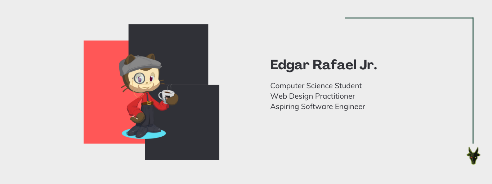

<picture>
  <source media="(prefers-color-scheme: dark)" srcset="coverphotodark.png" >
  <source media="(prefers-color-scheme: light)" srcset="coverphotolight.png">
  
</picture>

# Hi there, I'm Edgar! 👋

I'm a computer science student at FEU Institute of Technology and an aspiring software engineer dedicated to creating efficient software solutions and fun interfaces that maximizes user experience.

## About Me
- 🔭 I’m still exploring GitHub and the features it has to offer.
- ✨ I'm currently working on web design projects and improving my coding skills.
- 🌱 I’m currently preparing for ITS and GitHub certifications, and exploring open-source contributions.
- 📫 How to reach me: [edgartrafaeljr@gmail.com](mailto:edgartrafaeljr@gmail.com)

Feel free to connect with me! 😊

<!---
usergaia/usergaia is a ✨ special ✨ repository because its `README.md` (this file) appears on your GitHub profile.
You can click the Preview link to take a look at your changes.
--->
