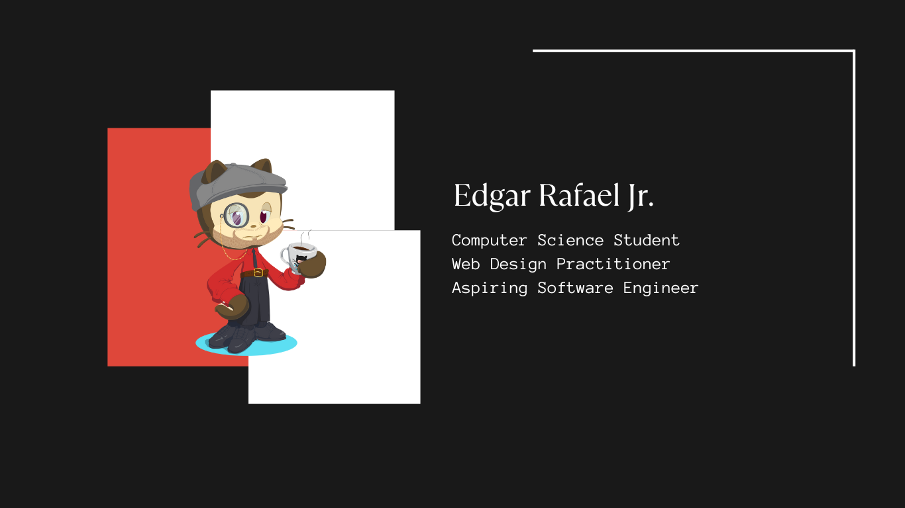

<picture>
  <source media="(prefers-color-scheme: dark)" srcset="AboutYou.png" width="800" height="400">
  <source media="(prefers-color-scheme: light)" srcset="AboutYou.png" width="800" height="400">
  
</picture>

- 👋 Hi, I’m @usergaia
- 👀 I’m interested in ...
- 🌱 I’m currently learning ...
- 💞️ I’m looking to collaborate on ...
- 📫 How to reach me ...
- 😄 Pronouns: ...
- ⚡ Fun fact: ...

<!---
usergaia/usergaia is a ✨ special ✨ repository because its `README.md` (this file) appears on your GitHub profile.
You can click the Preview link to take a look at your changes.
--->
