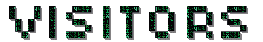

> <h3>God I loathe machine learning.</h3>

---

   

---

<h3 style="font-family: monospace;">Language</h3>

<h3 style="font-family: monospace;">Frontend & UI</h3>

<h3 style="font-family: monospace;">Backend & APIs</h3>

<h3 style="font-family: monospace;">Machine Learning & Data</h3>

<h3 style="font-family: monospace;">Dev Tools & Version Control</h3>

<h3 style="font-family: monospace;">Misc</h3>

---

 

---

